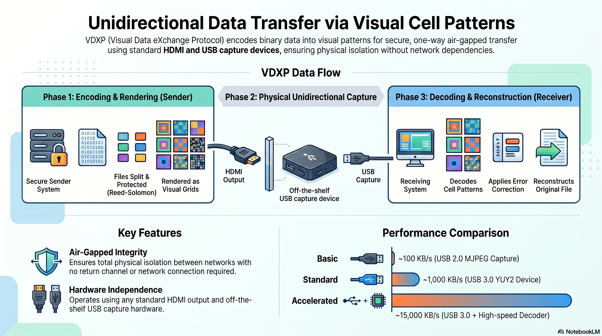

# vdxpy

**Python implementation of [VDXP](https://github.com/blackocean-tech/vdxp) (Visual Data eXchange Protocol) — unidirectional file transfer over HDMI.**

[]()
[](LICENSE)
[]()

vdxpy encodes files as visual cell patterns on screen, captures them via HDMI + USB capture device, and decodes them on the receiving side. No network connection. No USB drives. Every transfer is SHA256-verified.



```
[Sender PC] → Screen displays cell pattern → HDMI output →
  → [USB Capture Device] → USB →
  [Receiver PC] → Decode → File restored (SHA256 match ✓)
```

---

## Quick Start (~100 KB/s)

### Requirements

- Python 3.10+
- USB HDMI capture device (tested: [USB-CVHDUVC2](https://www.sanwa.co.jp/product/syohin?code=USB-CVHDUVC2), ~¥15,000)
- Two PCs (or one PC with HDMI loopback)

### Install

```bash
pip install -r requirements.txt
```

### Send a file

```bash
# On sender PC (displays pattern on screen)
python src/sender.py --file secret.pdf --profile cvhduvc2

# On receiver PC (captures via USB device)
python src/receiver.py --profile cvhduvc2 --output received.pdf
```

### Verify

```bash
sha256sum secret.pdf received.pdf
# Both hashes match ✓
```

---

## How It Works

vdxpy encodes data as visual cell patterns displayed on screen:

1. **Sender** splits file into chunks, applies Reed-Solomon error correction, and renders each chunk as a grid of colored/grayscale cells on the HDMI output
2. **Capture device** digitizes the HDMI signal via USB
3. **Receiver** decodes cell values, corrects errors via RS, and reassembles the file

### Key Innovations

- **BGR Cube Vertex 8-Color Palette** — Maximizes chroma distance to survive MJPEG compression artifacts
- **Y-only Grayscale (Y16/Y32/Y64)** — Eliminates chroma subsampling interference entirely
- **Fingerprint Skip** — Identifies duplicate frames in ~0.1ms using 32-cell hash
- **3-Stage Decode Filter** — Fingerprint → Header-only → Full decode, minimizing CPU load
- **Profile System** — Profiles optimized for different capture devices and environments

---

## Performance

| Configuration | Throughput | Hardware |
|--------------|-----------|----------|
| Free (MJPEG, 8-color, cs8) | ~100 KB/s | CVHDUVC2 or compatible USB2.0 MJPEG capture |
| With Accelerated Engine (YUY2, Y32, cs1) | ~15,000 KB/s | USB3.0 YUY2 device + Accel Engine |

All benchmarks SHA256-verified with random data payloads (5 MB -- 500 MB).

---

## Build Your Own Profile

Have different hardware? Use the diagnostic tools to optimize:

```bash
# Measure color margins and ECC utilization on your device
python tools/diagnose.py --profile cvhduvc2 --duration 30

# Capture a single frame for visual inspection
python tools/snap_frame.py --profile cvhduvc2

# Probe actual color distribution from your capture device
python tools/probe_colors.py --profile cvhduvc2
```

See the Tuning Guide (included with Accelerated Engine) for detailed optimization instructions.

---

## Comparison with Alternatives

| Solution | Throughput | Cost | Type |
|----------|-----------|------|------|
| **vdxpy + Accel** | **15.1 MB/s** | Contact us | Software + USB capture |
| **vdxpy (Free)** | **100 KB/s** | **Free + device** | OSS + USB capture |
| libcimbar | 106 KB/s | Free | Camera-based OSS |
| TGXf | ~4 KB/s | Free | QR-code stream |
| Fiber optic data diode | 1--100 Gbps | $5,000--$100,000+ | Dedicated hardware |

---

## Use Cases

- **Defense / Government** — Transfer data across isolated network segments
- **Industrial Control (OT/ICS)** — Export SCADA data from air-gapped networks
- **Financial** — Move data across regulatory network boundaries

---

## Accelerated Engine

The optional Accelerated Engine achieves up to ~150x higher throughput (with USB3.0 YUY2 hardware) through:

- Custom Cython Reed-Solomon decoder (Berlekamp-Massey + Chien + Forney)
- OpenMP parallel block decoding (up to 90.5x faster than standard RS)
- Optimized cell sampling with zero-copy memory access

The Accelerated Engine is available for purchase bundled with a verified USB capture device (Japan only).
Contact us for details: **contact@blackocean.tech**

---

## Feedback

Bug reports and feature requests are welcome via [Issues](https://github.com/blackocean-tech/vdxpy/issues). Pull requests are not actively reviewed at this time.

---

## License

MIT License. See [LICENSE](LICENSE) for details.

---

*All benchmarks performed with SHA256-verified random data. No transfer is reported as successful unless the output hash matches the input hash exactly.*
